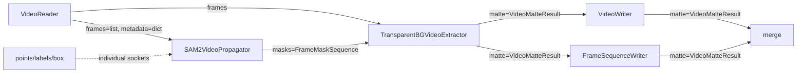

# SAM2 + transparent-background Haystack パイプライン 動画対応 実装計画

**作成日**: 2026-05-27
**ステータス**: 実装完了（v3、GPU 実機確認待ち）
**対象**: 既存の SAM2 + transparent-background Haystack 版（静止画用）を動画入力に拡張する

## 変更履歴

| 版 | 日付 | 内容 |
|----|------|------|
| v1 | 2026-05-27 | 初版ドラフト |
| v2 | 2026-05-27 | 1 回目・2 回目レビュー反映、ユーザー決定（案B = 共通モジュール抽出、出力モード `video / sequence / both`）反映 |
| v3 | 2026-05-27 | `_for_Movie` 実装、サブエージェントレビュー Critical 対応、非 integration 62 passed |

---

## 0. 背景

現状、SAM2 + transparent-background の Haystack 推論パスは静止画 1 枚を入力とする 3 ファイル構成で完成している。
- `gradio_app_sam2_transparent_BG_haystack.py` — Gradio 5 UI 本体
- `Sam2_Transparent_Background_Haystack.py` — Jupytext 正本（Colab 起動）
- `Sam2_Transparent_Background_Haystack.ipynb` — 上記から生成された Notebook

ユーザー要望は **「Haystack の Component 構造（疎結合・差し替え容易性・保守性）を堅持したまま、動画対応バージョンを別ファイルとして新規追加する」**。
ファイル名末尾に `_for_Movie` を付けて静止画版とは分離する。案B（共通モジュール抽出）のため、静止画版 UI には prompt 純粋関数の import 置換だけを行う。

---

## 1. ゴール定義

### 1.1 必達要件

1. 既存 3 ファイル（静止画版 UI / Jupytext / Notebook）の **動作・API は一切壊さない**。ただし共通ロジック抽出（案B）に伴う **最小限の import 置換** は例外的に許容する（セクション 4.2 を参照）。
2. 動画ファイル（mp4 / mov 等）を入力に取り、SAM2 で **最初のフレーム上の prompt** から **動画全体に mask を伝搬** し、各フレームに transparent-background を適用して、ユーザー選択に応じて **動画形式 / 連番静止画形式 / その両方** で結果を出力する。
3. Haystack Component 間の **疎結合は dict 型契約のみで担保** する（既存方針を踏襲）。新規型契約は `REFERENCE.md` とコード内コメントの両方に明記する。
4. 既存 Component（`SAM2Segmenter`, `TransparentBGExtractor`, `MaskCandidateSelector`, `MaskUnion`, …）は **シグネチャを変更せず再利用** する。動画固有の処理は **新規 Component** として `pipelines/components/` 配下に追加する。
5. Jupytext 正本ルールを踏襲し、`.py` を編集して `python -m jupytext --to ipynb` で `.ipynb` を生成する。
6. `torch.load(..., weights_only=True)`、`warm_up()` での遅延初期化・冪等性、エラー隠蔽禁止など既存規約を全て守る。
7. **エラー発火点の分離**: Component 層は `ValueError` / `RuntimeError` を raise する。Gradio callback 層で `except gr.Error: raise / except Exception as exc: raise gr.Error(...) from exc` でラップする（疎結合保持）。

### 1.2 非ゴール（今回スコープ外）

- 動画上の **複数フレームに対する追加 prompt 編集**（multi-frame interactive editing）。今回は first-frame prompt のみとする（次回拡張余地として contract には `prompts_by_frame` フィールドだけ用意）。
- MAM / GroundingDINO の動画拡張。今回は SAM2 video predictor + transparent-background のみ。
- 学習ループ・RL ループへの Haystack 適用（既存方針通り対象外）。
- リアルタイム webcam ストリーミング（オフライン処理のみ）。
- 時系列 α 平滑化アルゴリズムの自前実装（オプションとして「単純な過去 N フレーム移動平均」だけ提供）。

---

## 2. 成果物

### 2.1 新規ファイル

| 区分 | ファイル | 役割 |
|------|----------|------|
| UI | `gradio_app_sam2_transparent_BG_haystack_for_Movie.py` | Gradio 5 UI 本体（動画版） |
| Notebook 正本 | `Sam2_Transparent_Background_Haystack_for_Movie.py` | Jupytext 正本（Colab 起動） |
| Notebook | `Sam2_Transparent_Background_Haystack_for_Movie.ipynb` | 上記から生成 |
| Pipeline | `pipelines/sam2_tb_video_pipeline.py` | 動画用 Pipeline builder（3 段階に分割） |
| Component（純粋） | `pipelines/components/video_common.py` | 動画 I/O 純粋関数・`FrameSampler` 等 |
| Component（モデル） | `pipelines/components/video_model_components.py` | `VideoReader` / `SAM2VideoPropagator` / `TransparentBGVideoExtractor` / `VideoWriter` / `FrameSequenceWriter` |
| 共通 UI ヘルパー | `pipelines/components/ui_helpers.py` | prompt UI 純粋関数（`clamp_prompt_point`, `normalize_box_from_points`, `draw_prompt_overlay`, `select_sam2_prompt`, `extend_box_to_edge`）。静止画版・動画版から import |
| テスト | `tests/unit/test_video_common_components.py` | 純粋 Component の単体テスト |
| テスト | `tests/unit/test_video_pipeline_wiring.py` | Pipeline 結線テスト |
| テスト | `tests/unit/test_ui_helpers.py` | 共通 UI ヘルパー（既存静止画版の挙動と等価であることを保証） |
| テスト | `tests/integration/test_sam2_tb_video_pipeline.py` | `@pytest.mark.integration` 骨格 |

### 2.2 既存ファイルへの最小変更（案B採用に伴う）

| ファイル | 変更内容 |
|----------|----------|
| `gradio_app_sam2_transparent_BG_haystack.py` | 5 関数（`clamp_prompt_point` / `normalize_box_from_points` / `draw_prompt_overlay` / `select_sam2_prompt` / `extend_box_to_edge`）の **定義を削除し、`pipelines/components/ui_helpers` から import に置換**。それ以外（callback・UI 構築・パラメータ既定値）は変更禁止。`tests/unit/test_ui_helpers.py` で挙動同値を担保する。 |

### 2.3 更新ファイル（実装完了後の docs フェーズで実施）

| ファイル | 内容 |
|----------|------|
| `REFERENCE.md` | 動画用型契約（`VideoSource` / `FrameSequence` / `FrameMaskSequence` / `VideoMatteResult`）・新規 Component 一覧・`ui_helpers` 共通化・コマンド例を追記 |
| `WHITEBOARD.md` | 本タスクを完了として記録 |
| `ERROR_LOG.md` | 実装中に遭遇したエラーを ERR020 以降で採番して追記 |
| `requirements.txt` | 追加依存（`imageio[ffmpeg]` を想定）があれば追記 |

---

## 3. 型契約（Haystack Component 間の唯一の結合点）

動画版でも **dict 型契約のみで疎結合を担保** する。既存契約（`MaskSet`, `SelectedMask`, `MatteResult`）はそのまま再利用し、動画用に以下を追加する。

### 3.1 `VideoSource`（動画メタデータ）

```python
VideoSource = {
    "path": str,            # 入力動画ファイルの絶対パス
    "fps": float,           # frames per second
    "width": int,
    "height": int,
    "frame_count": int,     # 総フレーム数（推定値の場合あり）
    "codec": str,           # FourCC 文字列。不明時は ""
    "metadata": dict,       # 任意の付帯情報（ffprobe 出力等）
}
```

### 3.2 `FrameSequence`（フレーム列）

```python
FrameSequence = {
    "frames": list[np.ndarray],  # 各フレーム RGB uint8 (H, W, 3)。長尺ではメモリ上限に注意
    "fps": float,
    "count": int,                # len(frames) と一致
    "source": VideoSource | None,
    "frame_indices": list[int],  # 元動画上のフレーム index（サンプリング時に必要）
    "metadata": dict,
}
```

**設計判断**: 当面はメモリ上の `list[np.ndarray]` で扱う。理由は (a) Haystack の socket 型を明確に保つ、(b) SAM2 video predictor が一度フレーム列を `init_state` で受け取る API であるため。長尺対応は将来課題とし、本計画では **最大 frame_count を UI 上で警告表示** する（例: 1000 frame 超は要確認）。

### 3.3 `FrameMaskSequence`（フレーム別 mask 列）

```python
FrameMaskSequence = {
  "frame_masks": dict[int, np.ndarray],     # frame_index → bool mask (H, W)
    "object_ids": list[int],                  # SAM2 video predictor の object_id 列
  "frame_indices": list[int],               # frame_masks.keys() のソート済み snapshot
    "source": str,                            # 例: "sam2_video"
    "metadata": dict,                         # prompts, propagation params 等
}
```

**メモ**: 単一オブジェクトの場合 `object_ids = [1]`。複合対象 union は `MaskUnion` を **per-frame で適用するためのヘルパー** を `video_common.py` に置き、各 frame で `SelectedMask` を生成する流れを取る（既存 `MaskUnion` のシグネチャは変えない）。

### 3.4 `VideoMatteResult`（動画 matte 結果）

```python
VideoMatteResult = {
    # --- 動画形式の出力 ---
    "rgba_video_path":   str | None,   # webm/mov で書き出した RGBA 動画。codec 非対応または出力モード未選択時は None
    "alpha_video_path":  str | None,   # grayscale mp4 の α 動画。未選択時は None
    "preview_video_path": str | None,  # RGB mp4 の preview 動画。未選択時は None

    # --- 連番静止画形式の出力 ---
    "rgba_sequence_dir":   str | None,  # PNG (RGBA) 連番フォルダ。未選択時は None
    "alpha_sequence_dir":  str | None,  # PNG (grayscale) 連番フォルダ。未選択時は None
    "preview_sequence_dir": str | None, # PNG (RGB) 連番フォルダ。未選択時は None
    "sequence_pattern":   str | None,   # ファイル名パターン（例: "frame_{:06d}.png"）。連番出力ありの時のみ

    # --- 共通メタデータ ---
    "fps": float,
    "frame_count": int,
    "output_mode": str,    # "video" | "sequence" | "both"
    "metadata": dict,      # tb_mode, threshold, crop_padding, codec, fallback 履歴等
}
```

**設計判断**:

1. **出力モード**: UI で `video` / `sequence` / `both` を選択可能。`sequence` 単独時は video 系 path が None、`both` 時は両方の path / dir が埋まる。callback 側で必須でない path は受け取った後にスキップする。
2. **RGBA 動画コーデック**: cv2.VideoWriter の対応は環境依存（OpenCV ビルド・ffmpeg 同梱可否）のため、`VideoWriter` Component の `warm_up()` で **試験書き出し** を行い、`webm_vp9 → mov_png → 失敗時は ValueError` の順でフォールバックする。フォールバック履歴は `metadata["codec_fallback"]` に記録し、Gradio callback で警告通知。
3. **連番形式**: `outputs/<timestamp>/sequence/rgba/`, `.../alpha/`, `.../preview/` に PNG で保存。RGBA は 4ch PNG（cv2.imwrite で BGRA に変換して書き出し）、α は 1ch grayscale、preview は 3ch RGB。
4. **None になる条件**: ユーザーが出力モードで video を選んでいなければ video 系 path はすべて None。tb の output_type で `green / white / blur / rgba` のうち rgba を含まなければ rgba_*_path も None。`raise` ではなく明示的な None で「未選択」を表現する。

### 3.5 既存契約との互換性

| 契約 | 静止画版 | 動画版 |
|------|----------|--------|
| `MaskSet` | そのまま | per-frame で生成可能だが、動画版では基本不要（SAM2 video predictor は直接 mask を返す） |
| `SelectedMask` | 1 枚 mask | per-frame ループ内で再利用 |
| `MatteResult` | 1 枚画像 | per-frame で生成し、`VideoWriter` で連結 |

---

## 4. アーキテクチャ

### 4.1 Pipeline DAG（動画版）



**ポイント**:
- `VideoReader` の output socket: `@component.output_types(frames=list, metadata=dict)` — `frames` は `list[np.ndarray]`（`FrameSequence.frames` に対応）、`metadata` は `VideoSource` dict。Component が dict 全体を 1 socket で返すと型情報が薄れるため、**用途別に 2 socket に分割**する。
- `SAM2VideoPropagator` の prompt 入力は **既存 `SAM2Segmenter` と同じく `points` / `labels` / `box` の個別 socket**（dict 一括ではない）。これにより Gradio callback は既存 prompt 収集ロジックをそのまま渡せる。
- `VideoReader` と `VideoWriter` / `FrameSequenceWriter` は **I/O 専用 Component**。モデル推論は混在させない。
- `SAM2VideoPropagator` は SAM2 の `build_sam2_video_predictor` を内部で使う。`warm_up()` で predictor を構築し、`run()` で `init_state` → `add_new_points_or_box`（first-frame prompt）→ `propagate_in_video` を呼ぶ。冪等性のため `if self._video_predictor is not None: return` ガードを入れる。
- **2-phase 設計**: SAM2 で全フレーム mask を確保 → tb を per-frame batch 処理、の 2 段階に分ける（GPU context switch overhead 抑制、レビュー指摘 Medium-4）。
- `TransparentBGVideoExtractor` は内部で **既存 `TransparentBGExtractor` を per-frame で呼び出す**。これにより `tb_mode` / `crop_padding` / `tb_threshold` 等のパラメータをそのまま流用できる。
- `VideoWriter` は出力モード `video` / `both` 時のみ動作。`FrameSequenceWriter` は `sequence` / `both` 時のみ動作。両 Component とも入力が同じ `VideoMatteResult` でも、出力モードに応じて該当 path / dir のみ埋め、それ以外は None のままパススルーする。
- preview 動画は `tb_output_type`（green/white/blur/rgba）の選択を per-frame に適用。

### 4.1.1 Pipeline builder の粒度（3 分割）

レビュー指摘 Critical-4 に従い、既存粒度（`build_sam2_prompt_pipeline` / `build_mask_to_matte_pipeline` 等）と一貫させるため、**3 段階に分割**する。

| builder | 構成 | 用途 |
|---------|------|------|
| `build_video_reader_pipeline()` | `VideoReader` のみ | UI で第 1 フレーム抽出するときの軽量 pipeline |
| `build_sam2_video_propagation_pipeline()` | `VideoReader` + `SAM2VideoPropagator` | mask 伝搬の単独実行・デバッグ用 |
| `build_sam2_tb_video_pipeline()` | 上記 + `TransparentBGVideoExtractor` + `VideoWriter` + `FrameSequenceWriter` | end-to-end（UI が呼ぶ本命） |

### 4.1.2 `Pipeline.run(..., include_outputs_from=...)` 利用箇所

Gradio callback が中間 Component 出力を読む箇所:

| callback | include_outputs_from |
|----------|----------------------|
| 第 1 フレーム抽出 | `{"video_reader"}` |
| SAM2 propagation プレビュー（任意） | `{"sam2_video_propagator"}` — first-frame mask を overlay 表示 |
| 動画背景除去 end-to-end | `{"transparent_bg_video", "video_writer", "frame_sequence_writer"}` — `VideoMatteResult` の最終形を取り出す |

### 4.2 first-frame prompt の扱い（案B採用 — 共通モジュール抽出）

- UI 上で **第 1 フレームを抽出して prompt canvas に表示**。
- 既存の Positive/Negative Radio / Extend L/R/T/B ボタン群を踏襲し、SAM2 UI 規約 ERR019 を満たす。
- prompt は `points` / `labels` / `box` の **個別引数** として `SAM2VideoPropagator.run()` に渡す（既存 `SAM2Segmenter` パターンに一致）。

**ユーザー決定**: 静止画版から共通ロジックを `pipelines/components/ui_helpers.py` に抽出（案B）。

**移行手順**:

1. 既存 `gradio_app_sam2_transparent_BG_haystack.py` 内の 5 関数（`clamp_prompt_point` / `normalize_box_from_points` / `draw_prompt_overlay` / `select_sam2_prompt` / `extend_box_to_edge`）の **本体をそのまま** `pipelines/components/ui_helpers.py` に移植する。
2. 静止画版ファイルでは該当定義を削除し、`from pipelines.components.ui_helpers import (clamp_prompt_point, normalize_box_from_points, draw_prompt_overlay, select_sam2_prompt, extend_box_to_edge)` に置換する。
3. 動画版 UI も同じ import 文を使う。
4. `tests/unit/test_ui_helpers.py` で各関数の**境界値・端吸着・正負ラベル**の挙動を pinning（既存実装の振る舞いと同一であることを保証）。
5. 静止画版の callback / UI 構築 / パラメータ既定値は **一切変更しない**。`git diff gradio_app_sam2_transparent_BG_haystack.py` で「関数定義削除 + import 追加」のみであることを確認する。

**移行リスクと対策**:

- 静止画版が `gradio_app_sam2_transparent_BG_haystack.py` 自体を `python` 実行する前提で書かれている場合、import 経路が破綻しないよう `sys.path` に `PROJECT_ROOT` を加える既存ロジックを保持。
- `ui_helpers.py` は **gradio に依存しない純粋関数のみ** を置く（型 hints は numpy / Python 標準のみ）。Component 規約と同じく副作用なし・import が軽量。

### 4.3 メモリ管理

- フレーム列を全て RAM に展開する設計のため、長尺動画ではメモリ不足のリスクあり。
- 対策:
  - UI に **「最大フレーム数」スライダ**（default: 300, max: 2000）を置き、超過時は警告。
  - UI に **「フレーム間引き」ステップ**（1, 2, 4, …）を置き、`FrameSampler` で間引き可能。
  - SAM2 video predictor 実行後は `del state; torch.cuda.empty_cache()` を呼ぶ。
  - per-frame tb 推論ループは 50 frame ごとに `torch.cuda.empty_cache()`。

### 4.4 出力動画のコーデック選択とフォールバック

| 出力 | 拡張子 | コーデック | 備考 |
|------|--------|----------|------|
| RGBA | `.webm` | VP9 with alpha (`VP90`) | ブラウザ再生可。alpha 対応。 |
| RGBA（代替） | `.mov` | PNG (`png ` FourCC) | 大容量だが互換性高 |
| α grayscale | `.mp4` | mp4v / H.264 | grayscale を 3ch 複製で書き出す |
| preview | `.mp4` | mp4v | RGB |

**フォールバック仕様**（レビュー指摘 Critical-B 反映）:

1. `VideoWriter.warm_up()` で各 codec を順に試験 (`cv2.VideoWriter` の `.isOpened()` チェック)。
2. RGBA codec の優先順位: ユーザー選択 → `webm_vp9` → `mov_png` → 全滅時は `ValueError("No RGBA codec available")`。
3. フォールバック発生時は `metadata["codec_fallback"] = [("webm_vp9", "failed"), ("mov_png", "ok")]` の形で記録。
4. Gradio callback が受け取ったら、`gr.Warning(...)` でユーザーに通知。

**連番出力はコーデック非依存**: PNG (cv2.imwrite) で書き出すため、コーデック問題が発生した場合の安全策として常に利用可能（出力モード `sequence` のみ選択で運用可）。

※ `imageio[ffmpeg]` を追加依存とするかは検証段階で決定（cv2 単独で十分なら追加しない）。

---

## 5. UI 設計（Gradio 5）

### 5.1 主要コンポーネント

1. **動画アップロード**: `gr.Video(label="Input Video", sources=["upload"])`
2. **第 1 フレーム抽出ボタン**: `gr.Button("第1フレームを取得")` → 第 1 フレームを prompt canvas に転送
3. **SAM2 Prompt Canvas**: 既存と同じ `gr.Image(type="numpy", interactive=True)` を使い、point / box prompt を取得
4. **既存 prompt 制御**: Positive/Negative Radio, Input Mode (point/box), Clear, Extend L/R/T/B ボタン群（`ui_helpers` 共通化済み）
5. **動画処理パラメータ**:
    - `gr.Slider("最大処理フレーム数", 1, 2000, value=300)`
    - `gr.Slider("フレーム間引きステップ", 1, 10, value=1, step=1)`
6. **出力設定**（ユーザー追加要件）:
    - `gr.Radio("出力形式", ["動画 (video)", "連番静止画 (sequence)", "両方 (both)"], value="動画 (video)")`
    - `gr.Radio("RGBA 動画コーデック", ["webm_vp9", "mov_png"], value="webm_vp9")`— `出力形式` が sequence のみのときはグレーアウト
    - 既存 tb パラメータ（mode / threshold / crop_padding / output_type）を流用
7. **出力保存先**: タイムスタンプ付き `outputs/<YYYYMMDD_HHMMSS>/` 配下に以下の構造で保存:
    ```
    outputs/20260601_120000/
      video/         # 出力形式が video または both のとき生成
        rgba.webm | rgba.mov
        alpha.mp4
        preview.mp4
      sequence/      # 出力形式が sequence または both のとき生成
        rgba/        # frame_{:06d}.png (RGBA 4ch)
        alpha/       # frame_{:06d}.png (grayscale)
        preview/     # frame_{:06d}.png (RGB)
    ```
8. **実行ボタン**: 「動画背景除去を実行」
9. **進捗表示**: `gr.Progress()` を使い frame index とフェーズ名（「SAM2 propagation」/「TB extraction」/「writing」）を表示
10. **メモリ式表示**（レビュー指摘 Medium-5）: 処理中に現在の VRAM 使用量・フレームキャッシュサイズを `gr.Markdown` で informational に表示。
11. **出力コンポーネント**:
    - RGBA 動画・α 動画・preview 動画は `gr.Video`（出力形式で video を選んだときのみ可視化）
    - 連番出力は `gr.Files`（PNG サンプルを何枚かプレビュー表示）+ `gr.Textbox` に出力ディレクトリパスを表示
    - 完了メッセージ（`gr.Markdown`） — codec フォールバック履歴を含めて表示

### 5.2 制限事項（レビュー指摘 Medium-6）

- 今回版は **単一オブジェクトのみ対応** (`object_ids = [1]`)。複数オブジェクトは UI に記載して将来拡張としてロードマップし、`FrameMaskSequence.object_ids` にはコメントで `[1]` 固定と記載。
- テキスト prompt（GroundingDINO 経由）は UI 非表示。
- 時系列 α 平滑化は今回未実装。

### 5.3 ガイド表示

UI 冒頭に日本語で「動作フロー」「必須入力 = 動画 + 第 1 フレーム prompt」「任意入力 = テキスト prompt（未対応のため非表示）」を明記。
ERR019 を踏襲し、bbox 確定後の Extend L/R/T/B 4 ボタンを必ず提供する。

### 5.4 エラー通知とコンポーネント層の分離（レビュー指摘 Critical-3）

- **Component 層**: 例えば `VideoReader` が動画を開けなかった場合は `raise ValueError("Cannot open video: {path}")`。SAM2 prompt 未指定は `raise ValueError("prompt is empty")`。
- **Gradio callback 層**:
    ```python
    try:
        result = pipeline.run({...}, include_outputs_from={...})
    except gr.Error:
        raise  # 上位で既に gr.Error 化済みのものはそのまま
    except Exception as exc:
        raise gr.Error(f"動画処理に失敗しました: {exc}") from exc
    ```
- `try/except: pass` 禁止を厳守。Component 内でエラーを握りつぶさない。

---

## 6. Notebook（Jupytext 正本）

`Sam2_Transparent_Background_Haystack_for_Movie.py` の構成:

| Cell | 内容 |
|------|------|
| 1 | 依存インストール（`gradio==5.9.1`, `haystack-ai==2.29.0`, `transparent-background`, `pymatting`, `git+https://github.com/facebookresearch/sam2.git`, `opencv-python-headless`, `imageio[ffmpeg]`（必要なら）, `transformers>=4.25.0`, `addict`, `yapf`, `timm`, `supervision`, `pycocotools`） |
| 2 | Google Drive マウント・`PROJECT_ROOT` 検出・チェックポイント DL（既存 cell をそのまま流用） |
| 3 | 動画版 Gradio アプリ起動 — `gradio_app_sam2_transparent_BG_haystack_for_Movie.py` を `!{sys.executable}` で実行 |

`-q` フラグは使わず、CUDA / ffmpeg / build エラーを隠さない。

---

## 7. テスト戦略

### 7.1 単体テスト（pure pytest）

- `tests/unit/test_ui_helpers.py`（新規，レビュー指摘 Minor-2）
  - `clamp_prompt_point(x, y, w, h)`: 画像端付近のクリックが `0` / `w-1` / `h-1` に吸着される
  - `normalize_box_from_points(p1, p2)`: 2 点から `(x1, y1, x2, y2)` を min/max で正規化
  - `extend_box_to_edge(box, w, h, direction)`: 4 方向それぞれの拡張を保証
  - `select_sam2_prompt(...)`: point/box モード切り替えと positive/negative ラベルの振分け
  - `draw_prompt_overlay(...)`: 出力 shape と dtype を pinning（正確な描画内容は integration 寄り）
- `tests/unit/test_video_common_components.py`
  - `FrameSampler` のステップ間引きが正しい index を返す
  - `VideoSource` dict の必須キー網羅
  - `FrameMaskSequence.object_ids == [1]` が single-object 制限に一致
- `tests/unit/test_video_pipeline_wiring.py`
  - `build_video_reader_pipeline()` / `build_sam2_video_propagation_pipeline()` / `build_sam2_tb_video_pipeline()` の 3 builder がそれぞれ import エラーなく Pipeline オブジェクトを返す
  - DAG の socket 名・型が `VideoReader.frames` / `VideoReader.metadata` / `SAM2VideoPropagator.points|labels|box` / `TransparentBGVideoExtractor.matte` を含む
  - `VideoWriter` / `FrameSequenceWriter` の両方がパイプラインに存在し、出力モードに応じて選択動作する

### 7.2 統合テスト（`@pytest.mark.integration`）

- `tests/integration/test_sam2_tb_video_pipeline.py`
  - 短尺ダミー動画（10 frame, 64x64, np.uint8 RGB）を一時ファイルに作り、出力モードごとに end-to-end 実行し `VideoMatteResult` の path / dir がファイルとして存在することを確認
    - `output_mode=video` → `rgba_video_path` 存在・`*_sequence_dir` は `None`
    - `output_mode=sequence` → `*_sequence_dir` 存在・`*_video_path` は `None`、ディレクトリ内に 10 枚 PNG
    - `output_mode=both` → 両方存在
  - GPU / checkpoint がないと skip

### 7.3 Smoke チェック

- `python gradio_app_sam2_transparent_BG_haystack_for_Movie.py --help` が成功
- `python -m jupytext --to ipynb Sam2_Transparent_Background_Haystack_for_Movie.py` が成功
- `pytest -m "not integration" -q` で全て pass

---

## 8. セキュリティ・規約遵守チェックリスト

- [ ] `torch.load(..., weights_only=True)` を全箇所で使用
- [ ] `try/except: pass` 等の握りつぶしなし。Component 層は `ValueError` / `RuntimeError`、Gradio callback 層で `gr.Error` にラップ
- [ ] ハードコード禁止：チェックポイントパス・正規化パラメータは環境変数 or 設定から取得
- [ ] `segment-anything/` 配下を変更しない
- [ ] 静止画版 `gradio_app_sam2_transparent_BG_haystack.py` の変更は **関数定義削除 + ui_helpers import 追加のみ**。callback / UI 構築 / パラメータ既定値は不変。
- [ ] Jupytext / Notebook（`Sam2_Transparent_Background_Haystack.py` / `.ipynb`）は変更しない
- [ ] 重いモデル初期化は `warm_up()` 内・冪等性ガードあり（`if self._predictor is not None: return`）
- [ ] Component の `run()` は具体型 socket を持つ。`VideoReader` は `@component.output_types(frames=list, metadata=dict)`
- [ ] `SAM2VideoPropagator.run()` の prompt 入力は `points` / `labels` / `box` の個別 socket（dict 一括ではない）
- [ ] Pipeline 中間出力を Gradio callback で読む場合 `include_outputs_from=` を指定
- [ ] Jupytext: `.py` を編集し `.ipynb` を生成（手書き禁止）
- [ ] Colab install cell に `-q` を使わない
- [ ] 日本語コメントを関数冒頭・非自明な論理ブロック先頭に記述
- [ ] `ERROR_LOG.md` 追記は ERR020 以降で採番

---

## 9. リスクと回避策

| リスク | 影響 | 回避策 |
|--------|------|--------|
| SAM2 video predictor (`build_sam2_video_predictor`) の `init_state()` の入力フォーマットが image predictor と異なる（ディレクトリパスを期待する可能性あり） | propagation 実装が動かない | `warm_up()` で 5-frame ダミー動画による smoke を走らせ、「ディレクトリ / ファイルパス / list[np.ndarray] / np.ndarray (T,H,W,3)」のうちどれが受け付けられるか検出する。必要なら一時ディレクトリにフレームを PNG として書き出してから渡すアダプタを含める。検出結果は `ERROR_LOG.md` ERR020 として記録。 |
| 長尺動画でメモリ不足 | OOM | UI で最大フレーム数を制限。`FrameSampler` で間引き。`torch.cuda.empty_cache()` を 50frame 毎、及び SAM2 フェーズ終了時 |
| RGBA 動画コーデック非対応（OpenCV ビルド依存） | 書き出し失敗 | warm_up で `cv2.VideoWriter` の作成テスト。`webm_vp9 → mov_png → ValueError` の順でフォールバックし、全滅時は Gradio callback で `gr.Error`。ユーザーには `sequence` 出力への切り替えを推奨。 |
| 既存 `TransparentBGExtractor` の per-frame 呼び出しコスト | 推論時間長大化 | tb の Remover インスタンスを使い回す（既存 `_cache` 実装が役立つ）。2-phase 設計で SAM2 と tb を分離し GPU context switch を抑制。間引きステップで対処可能 |
| Jupytext 生成 `.ipynb` の差分肥大 | コミット負荷 | `.py` を正本として変更時のみ regenerate |
| `ui_helpers.py` 抽出に伴う静止画版のデグレード | 静止画版が壊れるリスク | `tests/unit/test_ui_helpers.py` で既存振る舞いを pinning。`git diff` で「関数定義削除 + import 追加」だけであることをレビュー |
| 連番出力ディレクトリの大量ファイル生成でディスク限界 | 書き出し失敗 | `FrameSequenceWriter` で保存前に空き容量を `shutil.disk_usage()` でチェックし、不足時は `RuntimeError` |

---

## 10. 作業ステップ（フェーズ分割）

### Phase A: 計画レビュー（本ドキュメント）

1. 本ドキュメントを作成（v1）
2. サブエージェント（Explore agent）に **1 回目のレビュー** を依頼【完了】
3. サブエージェント（Explore agent）に **2 回目のレビュー**（Haystack 設計品質重点）を依頼【完了】
4. ユーザー決定（案B 採用 / 出力モード `video|sequence|both`）を反映し v2 として更新【本ステップ = 現在】

### Phase B: 実装

1. `pipelines/components/ui_helpers.py` 作成（静止画版関数を移植） + `tests/unit/test_ui_helpers.py`
2. 静止画版 `gradio_app_sam2_transparent_BG_haystack.py` にて 5 関数定義を削除し `ui_helpers` から import に置換 → 既存テスト + 手動 smoke で静止画版が壊れていないことを確認
3. `pipelines/components/video_common.py` 作成 + unit test
4. `pipelines/components/video_model_components.py` 作成（`VideoReader` / `SAM2VideoPropagator` / `TransparentBGVideoExtractor` / `VideoWriter` / `FrameSequenceWriter`）
5. `pipelines/sam2_tb_video_pipeline.py` 作成（3 builder 分割） + pipeline wiring test
6. `gradio_app_sam2_transparent_BG_haystack_for_Movie.py` 作成（出力モード UI ・エラーラップ・進捗表示含む）
7. `Sam2_Transparent_Background_Haystack_for_Movie.py` 作成
8. `python -m jupytext --to ipynb` で `.ipynb` 生成
9. `tests/integration/test_sam2_tb_video_pipeline.py` 骨格作成（3 出力モードケース含む）
10. `pytest -m "not integration" -q` と `--help` smoke を実行

### Phase C: 実装レビュー

1. サブエージェントレビュー（観点: 正確性・パフォーマンス・セキュリティ・可読性・規約準拠）
2. 重要指摘を修正

### Phase D: ドキュメント更新

1. `REFERENCE.md`: 動画用型契約、新規 Component カタログ、`ui_helpers` 共通化、出力モード、コマンド例、ファイルマップを追記
2. `WHITEBOARD.md`: 本タスクを「完了」セクションへ記録
3. `ERROR_LOG.md`: 実装中に遭遇したエラーを ERR020 以降で追記
4. `requirements.txt`: 追加依存があれば追記

---

## 11. 完了基準

- [ ] 新規ファイル（`_for_Movie` 付き 3 ファイル + Pipeline / Component / `ui_helpers`）が動作（`--help` smoke + unit test pass）
- [ ] `pytest -m "not integration" -q` 全 pass
- [ ] Jupytext で `.ipynb` 生成成功
- [ ] 3 つの出力モード (`video` / `sequence` / `both`) が integration test 骨格で確認されている
- [ ] codec フォールバック・出力ディレクトリ構造がドキュメントと一致
- [ ] サブエージェントレビューで Critical 指摘なし
- [ ] `REFERENCE.md` / `WHITEBOARD.md` / `ERROR_LOG.md` 更新済み
- [ ] 静止画版 `gradio_app_sam2_transparent_BG_haystack.py` の `git diff` が **関数定義削除 + import 追加のみ** であることを確認
- [ ] 静止画版 `.py` / `.ipynb` Jupytext ペアは **一切変更されていない**ことを `git diff` で確認

---

## 12. オープン質問とレビューでの決定事項

| # | 質問 | 決定 |
|---|------|------|
| 1 | RGBA 動画のデフォルトコーデック | `webm_vp9`。フォールバックで `mov_png` を試し、全滅時は `gr.Error` |
| 2 | 最大フレーム数 default / upper | default 300 / upper 2000（デフォルトとして採用） |
| 3 | 静止画版 prompt UI 関数の扱い | **案B**（ユーザー決定）。`pipelines/components/ui_helpers.py` に抽出し両ファイルで import。静止画版には **関数定義削除 + import 追加** のみ発生 |
| 4 | テキスト prompt | 今回 UI 非表示 |
| 5 | 時系列 α 平滑化 | 今回未実装（将来拡張） |
| 6 | 出力形式 | **ユーザー追加要件**: `video` / `sequence` / `both` を UI で選択可能。連番は専用フォルダ `outputs/<ts>/sequence/{rgba,alpha,preview}/` に保存 |
| 7 | 複数オブジェクト | 今回は single-object のみ（`object_ids = [1]` 固定） |
| 8 | Component 層での エラー raise 型 | **`gr.Error` ではなく `ValueError` / `RuntimeError`**。Gradio callback で `gr.Error` にラップ（レビュー Critical-3） |
| 9 | Pipeline builder 粒度 | **3 分割**: `build_video_reader_pipeline` / `build_sam2_video_propagation_pipeline` / `build_sam2_tb_video_pipeline`（レビュー Critical-4） |
| 10 | SAM2 `init_state()` の入力フォーマット | **`warm_up()` で 5-frame smoke** で検出し `ERR020` として記録。必要に応じ一時ディレクトリに PNG 出力してから渡すアダプタを導入 |
