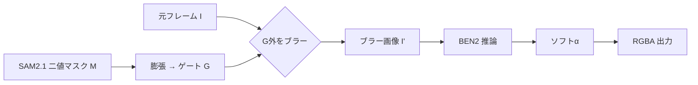

# ルートA案 仕様書 ver1.0 ―「ブラー誘導 → BEN2 再α化」

- 作成日: 2026-06-22
- 軸: **合成軸**（SAM2 領域と BEN2 αの融合方式）
- 親文書: [動画αマット生成パイプライン 要件定義書 ver1.0](2026-06-22_動画αマット_要件定義書.md)
- 対になる案: [ルートB案 仕様書（領域ゲート刈り）](2026-06-22_動画αマット_ルートB案_領域ゲート_仕様書.md)

> 本案は合成軸の選択肢。追跡軸（追跡A案＝毎フレーム検出 / 追跡B案＝propagation＋再追跡）の**どちらの上にも乗せられる**独立レイヤーである。
>
> 下地マスク M は、検出（RF-DETR）→ **ID 追跡モデル（ByteTrack / BoT-SORT）** → SAM2.1 の順で供給される。ID 追跡モデルを挾む意味は、SAM2.1 はセグメンタで ID 維持（追跡）が構造的弱点なため、複数対象の ID 維持・遮蔽・再出現を専用 MOT に逃がすため（詳細は要件定義書 §10.1）。本案のブラー範囲を決める領域 M も track_id に紐づいてフレーム跨ぎで一貫する。

SAM2.1 領域の**外側をブラー**して被写体だけをシャープに残した動画を作り、それを BEN2 に通す。
BEN2 は saliency（顕著性）ベースのαマット生成なので、**「ピントが合っている＝主役」という手がかりを与えて注目を誘導する**狙い。
ハードな切り取りでなくブラーという連続的な勾配で背景を抑えるため、**境界・毛先のソフトさを壊しにくい**のが期待点。

> 前提理解: BEN2 は `inference()` / `segment_video()` ともに**マスク入力ポートを持たない**。
> よって「マスクを注入」するのではなく、「入力画像を加工して間接的に誘導する」のが本案の発想。
>
> 実装方針: 本案の各処理（膜張・ブラー・BEN2 推論・合成）は Haystack 2.x の Component として機能分割・単一責任・疎結合・I/O 契約で実装する（要件定義書 §6.1 / `.github/skills/haystack-pipeline/SKILL.md` 準拠）。

---

## A-2. 処理フロー

```text
入力: 元フレーム I、SAM2.1 二値マスク M（追跡軸から供給）

1. M を膨張 → ゲート領域 G（毛先を巻き込む余白つき）
2. 元フレーム I に対し、G の外側を強ブラー → ブラー画像 I'
   （G の内側＝被写体はシャープ維持）
3. I' を BEN2 に入力 → ソフトα A_ben を生成
4. A_ben をそのまま、または境界帯へ合成 → 最終α
5. RGBA 出力
```



---

## A-3. 構成要素

| 役割 | 採用 | 備考 |
| --- | --- | --- |
| 領域 | SAM2.1（二値マスク M） | ブラー範囲を決める下地。追跡軸から供給 |
| ゲート | 膨張マスク G | 毛先の逃げ代を確保 |
| ブラー | Gaussian 等（背景側のみ） | 強度はチューニング対象（数値は実機で決定＝対象外） |
| α生成 | BEN2 base | ブラー画像から再α化。`refine_foreground` は毛先重視なら検討（推論時間増） |

---

## A-4. パラメータ（実機チューニング対象）

| パラメータ | 役割 | MVP 方針 |
| --- | --- | --- |
| 膨張量（G の広さ） | 毛先の逃げ代。BEN2 にブラー境界を関心外へ追い出す | 仮値で開始、評価後に調整 |
| ブラー強度／カーネル | 背景抑制と境界滲みのトレードオフ | 弱→背景残り、強→境界滲み。仮値で開始 |
| `refine_foreground` | 毛先エッジ精細化 | 毛先が主役なら True を検討（速度と相談） |

> 数値は裏取りなしの推測になるため本書では空欄。実機チューニング領域（要件定義 §3 対象外）。

---

## A-5. 長所／短所

| 長所 | 短所 |
| --- | --- |
| ハードカットしないので**毛先のソフトαが残りやすい** | ブラー1パス分の処理が増える |
| BEN2 が背景の偽陽性を拾いにくくなる（誘導効果・**仮説**） | 誘導が効く保証がない（saliency が背景境界に反応する可能性） |
| 境界が自然（連続勾配） | ブラー強度が弱いと背景残り、強すぎると境界に滲み |

---

## A-6. リスク（要検証）

| リスク | 内容 | 緩和策 |
| --- | --- | --- |
| **誘導効果が仮説** | ブラーで BEN2 のαが本当に被写体へ寄るかは未実測。効かなければ本案の存在意義が消える | ルートA本採用前に BEN2 の saliency 挙動を一次裏取り＋10秒実機評価 |
| ブラー境界の偽エッジ | G の縁に BEN2 が反応して偽のエッジを作る恐れ | G を十分外側に取り、境界を BEN2 の関心外へ追い出す |

> 中核仮説「ブラーが BEN2 の注目を誘導する」は**未検証の設計仮説**。事実として断定せず、MVP で測る対象とする。

---

## A-7. 受け入れ確認観点（本案固有）

- 誘導により BEN2 の背景偽陽性が、誘導なし（ルートB相当）より減っているか。
- 毛先のソフトαが連続勾配として保たれているか（黒縁/ベタ抜きでない）。
- ブラー境界に由来する偽エッジが出ていないか。

---

## A-8. MVP 適性

**△（毛先が課題になった時の改善カード）。**
まず軽量なルートBで品質を確認し、毛先が切られて不満な場合に本案で連続勾配の効果を測る位置づけ。
本採用するなら、A-6 の中核仮説の裏取りを先行すること。
