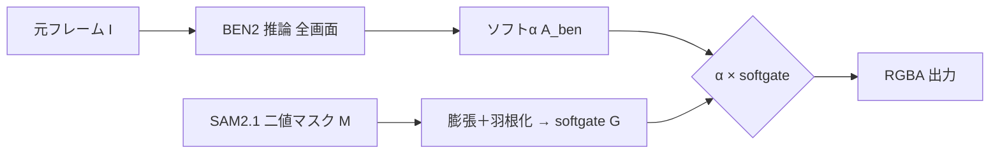

# ルートB案 仕様書 ver1.0 ―「SAM2.1 領域ゲート → BEN2 α刈り取り」

- 作成日: 2026-06-22
- 軸: **合成軸**（SAM2 領域と BEN2 αの融合方式）
- 親文書: [動画αマット生成パイプライン 要件定義書 ver1.0](2026-06-22_動画αマット_要件定義書.md)
- 対になる案: [ルートA案 仕様書（ブラー誘導）](2026-06-22_動画αマット_ルートA案_ブラー誘導_仕様書.md)

> 本案は合成軸の選択肢。追跡軸（追跡A案＝毎フレーム検出 / 追跡B案＝propagation＋再追跡）の**どちらの上にも乗せられる**独立レイヤーである。
>
> ゲートの母体となる領域 M は、検出（RF-DETR）→ **ID 追跡モデル（ByteTrack / BoT-SORT）** → SAM2.1 の順で供給される。ID 追跡モデルを挾む意味は、SAM2.1 はセグメンタで ID 維持（追跡）が構造的弱点なため、複数対象の ID 維持・遮蔽・再出現を専用 MOT に逃がすため（詳細は要件定義書 §10.1）。本案で「領域外の偏陰性を刈る」際の track_id ごとのゲート一貫性も MOT の ID が支える。

BEN2 を通常どおり全画面に走らせてソフトαを生成し、**SAM2.1 の（膨張）領域マスクでαをゲートして、領域外のαを消す**。
BEN2 が他の顕著物体（別人・小物）を拾った**偽陽性を、SAM2 の対象 ID で刈り取る**のが目的。
実装が最も単純で軽い。

> 前提理解: BEN2 は**全画面の前景/背景**を分離するモデルで、対象選択の口を持たない。
> よって「対象選択」は SAM2.1 の領域マスクが担い、BEN2 はαの供給に専念する役割分担。
>
> 実装方針: 本案の各処理（BEN2 推論・領域ゲート・刈り取り・合成）は Haystack 2.x の Component として機能分割・単一責任・疎結合・I/O 契約で実装する（要件定義書 §6.1 / `.github/skills/haystack-pipeline/SKILL.md` 準拠）。

---

## B-2. 処理フロー

```text
入力: 元フレーム I、SAM2.1 二値マスク M（追跡軸から供給）

1. M を膨張 → ゲート G、さらに羽根化（feather）して段差を防ぐ
2. BEN2 を元フレーム I にそのまま適用 → ソフトα A_ben
3. α合成: A_out = A_ben × softgate(G)
   （G 内はそのまま、G 外は 0 へ。境界は羽根化で滑らかに）
4. RGBA 出力
```



---

## B-3. 構成要素

| 役割 | 採用 | 備考 |
| --- | --- | --- |
| 領域 | SAM2.1（二値マスク M） | ゲートの母体。追跡軸から供給 |
| ゲート | 膨張＋羽根化（feather）G | ハード段差回避が肝 |
| α生成 | BEN2 base（全画面） | 誘導なしの素のα |
| 合成 | α × softgate | 単純乗算ベース |

---

## B-4. パラメータ（実機チューニング対象）

| パラメータ | 役割 | MVP 方針 |
| --- | --- | --- |
| 膨張量（G の広さ） | 毛先を G 外へ逃がさないための余白 | 過小→毛先切れ、過大→背景偽陽性復活。仮値で開始 |
| 羽根化幅（feather） | ゲート境界の段差を滑らかにする | 仮値で開始、評価後に調整 |

> 数値は裏取りなしの推測になるため本書では空欄。実機チューニング領域（要件定義 §3 対象外）。

---

## B-5. 長所／短所

| 長所 | 短所 |
| --- | --- |
| **最軽量・最短実装**（後段の乗算1回） | ゲートが固ければ**毛先が切られる**（毛先が G 外に伸びると消える） |
| BEN2 の領域外偽陽性を確実に除去 | SAM2 のロスト/欠けがそのままαの欠けに直結 |
| デバッグ容易（αと G を別々に見られる） | G の膨張量・羽根幅が毛先品質を左右（チューニング必須） |

---

## B-6. リスク（要検証）

| リスク | 内容 | 緩和策 |
| --- | --- | --- |
| **毛先の刈り取り** | 毛先が G 外に出ると刈られる＝最重要の毛先品質と正面衝突しうる | 膨張量と羽根化幅で逃がす。ただし過大膨張は背景偽陽性を呼び戻すトレードオフ |
| ロストの穴 | SAM2 側のロストがそのまま穴になる（ルートAより穴に弱い） | 追跡B案のロスト復帰と組み合わせる／追跡A案で穴自体を減らす |

---

## B-7. 受け入れ確認観点（本案固有）

- 領域外の BEN2 偽陽性が確実に 0 になっているか。
- 毛先が G 外に出て刈られていないか（黒縁/ベタ抜きでない）。
- ゲート境界に段差（ハードエッジ）が出ていないか。

---

## B-8. MVP 適性

**○（合成軸の初手として推奨）。**
最軽量で確実に偽陽性が消えるため、まず本案で10秒動画の受け入れ基準を測る。
毛先が切られて不満なら、ルートA（ブラー誘導）で連続勾配の効果を確認する。

> 最短の通し系: `追跡A案（毎フレーム検出） → SAM2.1 → BEN2 → ルートB（領域ゲート刈り）`。
> これが要件定義 §7 の10秒評価へ一直線で到達する最小構成。
