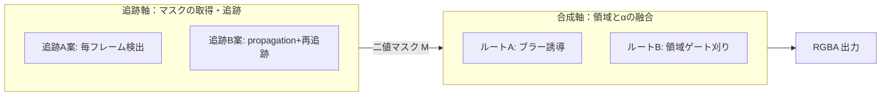

# 動画αマット生成パイプライン 要件定義書 ver1.0

- 作成日: 2026-06-22
- 対象: 追跡対象（人物等）を動画から切り抜き、透明背景（RGBA / α）で出力する MVP
- 関連仕様書:
  - [ルートA案 仕様書（ブラー誘導 → BEN2 再α化）](2026-06-22_動画αマット_ルートA案_ブラー誘導_仕様書.md)
  - [ルートB案 仕様書（SAM2.1 領域ゲート → BEN2 α刈り取り）](2026-06-22_動画αマット_ルートB案_領域ゲート_仕様書.md)
- 出典: [調査/2026-06-22_トラッキング許可方法調査とBEN2採用計画.md](../調査/2026-06-22_トラッキング許可方法調査とBEN2採用計画.md)

> 本書は長時間セッションで断片化した調査結果を、要件定義として粒度を揃えて再編したものです。
> 新規の事実主張は追加していません。技術前提は調査時に一次ソースで裏取り済みの事実のみを使用します。

---

## 1. 目的

追跡対象を動画から切り抜き、**透明背景（RGBA / α）として出力**する。
本 MVP の目的は処理速度の最適化ではなく、**10秒程度のテスト動画で、出力αが主観的に満足できる品質に達するかを検証すること**。

---

## 2. 設計の2軸（最重要：混同防止）

本パイプラインの設計判断は、**独立した2つのレイヤー（軸）**に分かれる。
調査セッションでは名前が似た「A/B」が両軸に登場し混同の原因になったため、本書で明確に分離する。

| 軸 | 何を決めるか | 選択肢 | 本書での扱い |
| --- | --- | --- | --- |
| **追跡軸** | 各フレームでマスクを「どう取る・どう追うか」 | 追跡A案（毎フレーム検出）／追跡B案（propagation＋ロスト再追跡） | 本書 §8 で定義 |
| **合成軸** | SAM2 領域と BEN2 αを「どう融合するか」 | ルートA（ブラー誘導）／ルートB（領域ゲート刈り） | 個別仕様書で定義 |

- 2軸は**直交**しており、任意の組み合わせが成立する（例: 追跡A案 × ルートB）。
- MVP では各軸を1案ずつ単独評価し、効果を切り分ける。
- 命名規約: 追跡軸は「追跡A案 / 追跡B案」、合成軸は「ルートA / ルートB」と表記し、以後混同しない。



---

## 3. スコープ

| 区分 | 内容 |
| --- | --- |
| 対象（in） | 単一カット動画のα生成、ロスト復帰、毛先エッジ品質の確認、追跡軸/合成軸の単独評価 |
| 対象外（out） | forward-only / チャンク化の実装最適化、occlusion 閾値の精密チューニング、distractor 乗り換え対策、リアルタイム化、長尺（>30秒）最適化、ブラー強度・羽根化幅の数値最適化 |

> 対象外は「いま詰める問題でない」論点として意図的に切り離し、品質評価フェーズをブロックしない構造にする。品質評価が OK になった後に着手する。

---

## 4. 入出力定義

| 項目 | 仕様 |
| --- | --- |
| 入力 | 動画ファイル（想定3〜5秒、テストは約10秒） |
| ユーザー入力（プロンプト） | 追跡 BBOX の追加・削除、ポイントプロンプト（ポジティブ/ネガティブ）の追加・削除（§5.1 参照） |
| 中間 | 検出 BBOX＋ID、ユーザー編集後のプロンプト集合、SAM2 二値マスク（可能なら logits/probability）、BEN2 ソフトα |
| 出力 | フレーム連番の RGBA（またはαチャンネル系列）。後段で透明背景合成／UE5 受け渡しに使える形 |

---

## 5. 機能要件

| ID | 要件 | 優先度 |
| --- | --- | --- |
| F-1 | **追跡対象のα生成**：対象を毎フレームα化する | 必須 |
| F-2 | **ロスト復帰**：対象を見失った段階で再追跡・再プロンプトし、ロストフレームを最小化する（ロスト＝品質劣化に直結のため最重要） | 必須 |
| F-3 | **毛先エッジ**：SAM2 二値では描けない毛先を、BEN2 のソフトα＋膨張ゲートで補う | 必須 |
| F-4 | **複数対象**：複数被写体時も ID ごとにαを出せる（MVP では1名で可、余力で確認） | 任意 |
| F-5 | **追跡 BBOX の追加・削除**：検出器（RF-DETR）が拾えない対象をユーザーが BBOX で追加でき、誤検出/不要対象の BBOX を削除できる（§5.1） | 必須 |
| F-6 | **ポイントプロンプト（ポジティブ/ネガティブ）**：対象に含めたい箇所をポジティブ点、除外したい箇所をネガティブ点として追加・削除でき、SAM2.1 のマスクを対話的に補正できる（§5.1） | 必須 |

> F-5/F-6 は SAM2.1 プロンプト層（追跡軸）に属し、**追跡A案・追跡B案の双方**、および合成軸ルートA/B の下地マスク M の品質を直接左右する共通機能。

### 5.1 プロンプト編集 操作仕様

SAM2.1 は box・ポジティブ/ネガティブ点・マスクをプロンプトとして受け付け、追加プロンプトで後から修正できる設計。これに合わせ、ユーザーが対話的に対象を確定/補正できる操作を定義する。

| 操作 | 内容 | SAM2.1 への反映 |
| --- | --- | --- |
| BBOX 追加 | 未検出対象を矩形で囲み、新しい track_id を割り当てて追跡対象に加える | 当該 ID の box プロンプトとして投入 |
| BBOX 削除 | 誤検出/不要な対象の矩形を削除し、追跡対象から外す | 当該 ID をプロンプト集合・マスク出力から除外 |
| ポジティブ点 追加/削除 | 対象に含めたい画素を点指定（含める方向の補正） | 該当 ID の positive point として加減 |
| ネガティブ点 追加/削除 | 対象から除外したい画素を点指定（隣接物・背景の混入除去） | 該当 ID の negative point として加減 |

操作上の要件:

- **対象（ID）単位**でプロンプトを管理し、点・box は track_id に紐づける（複数対象時に取り違えない）。
- **どのフレームでも**プロンプトを追加・修正でき、結果を再反映できる（追跡B案ではその地点から前方へ再伝播、追跡A案では当該フレーム以降の単発適用）。
- プロンプト編集後は**該当 ID のマスクのみ**を再計算し、無関係な対象を再計算しない（非機能 §6 の計算量制約を守る）。
- 編集前後のプロンプト集合は中間データとして保持し、再現性（§6）を担保する。

#### ★最重要: box＋点の「結合」は対象 1 つにつき逐次で行う（ハルシネーション注意）

ここは誤解しやすい箇所なので明記する。

- 一部の UI ガイドに「SAM2 では box と点の結合プロンプトは使えない／一度に 1 組み合わせのみ」とあるが、**これは Gradio 等 UI 実装側の制約であり、モデル本体の制約ではない**。
- 内部実装上、SAM2（現行 SAM3 トラッカー含む）は box を受け取ると**角／中心の点トークンに変換し、box の内外を示すラベルを割り当てる**。つまり **box も内部的には「点トークン」として扱われる**ため、box → 同じ obj_id に点を追加、という**逐次呼び出しなら正しく結合される**。
- **実装方針**: 同じ `obj_id` に対し、まず box を `add_new_points_or_box` で投入 → 同じ obj_id に points+labels を追加投入 → propagate。これが本フローの正しい形。**UI 側で「box と点は排他」と誤って制限しない**こと。
- 出典: [sam2-playground PROMPT_GUIDE](https://huggingface.co/spaces/jhj0517/sam2-playground/blob/193878720cedea16d89232721bca364f0eef1a73/docs/PROMPT_GUIDE.md) / [SAM3 video tracking negative box](https://magazine.ediary.site/blog/sam3-video-tracking-negative-box)。

> UI 実装は Gradio 5 / SAM2 UI 層（既存スキル `.github/skills/gradio5-sam2-ui/SKILL.md` 準拠）で行う。本書は要件のみを定義し、Canvas 操作・イベント配線の具体は実装計画で詰める。

---

## 6. 非機能要件

| 項目 | 基準 |
| --- | --- |
| レイテンシ | 10秒動画に対しα出力まで **1〜2分以内は許容**。「10秒に30分」級は不可 |
| 計算量 | O(N²) の全再伝播でコスト爆発しないこと（設計上の禁止事項） |
| 再現性 | 同一入力で同一出力（乱数なし、もしくは seed 固定） |
| 比較統制 | 追跡軸/合成軸を比較する際、BEN2 設定・出力解像度・fps を完全に揃える（差分要因を1つに固定） |

### 6.1 設計方針（Haystack による疎結合アーキテクチャ）

本計画は `.github/skills/haystack-pipeline/SKILL.md` に従い、Haystack 2.x の Component を単位として以下の原則で実装する。

- **機能分割／単一責任**: 画面解釈（検出）・ID 追跡（MOT）・マスク（SAM2.1）・α/毛先（BEN2）・合成（ルートA/B）を**それぞれ独立した Component** に分け、1 Component＝1 責務にする。
- **疎結合**: Component 間は**安定した I/O 契約（型付き入力/出力）**でのみ接続し、内部実装に依存しない。検出器/追跡/α モデルの差し替えが頻発する前提で、契約を崩さずに差し替え可能にする。
- **I/O 契約の固定**: Component 境界の入出力スキーマ（マスク・BBOX+track_id・α など）を明示し、契約変更は配線不整合を連鎖させるため慎重に扱う。
- **遅延初期化**: import 時に重いモデルを初期化しない（Haystack 版の既存ルール）。
- これにより可読性・保守性を高く保ち、修正時の影響範囲を局所化する。

---

## 7. 受け入れ基準（＝MVPの合否）

1. 約10秒のテスト動画で、**ロストフレームが体感ゼロ〜許容範囲**。
2. **毛先が「黒縁/ベタ抜き」になっていない**（BEN2 ソフトαが効いている）。
3. 出力αを透明背景に合成して**主観的に満足**できる。
4. 生成完了が **2分以内**。

> 合否は数値 KPI ではなく主観評価を一次基準とする（MVP の狙いが「満足いくか」の確認のため）。

---

## 8. 追跡軸の選択肢（独立レイヤー）

合成軸（ルートA/B）の下地となる二値マスク M を供給するレイヤー。
**両案とも合成軸のどちらのルートにも接続できる。**

### 追跡A案 ―「毎フレーム検出」愚直ベースライン

| 項目 | 内容 |
| --- | --- |
| コンセプト | SAM2 の動画 propagation／メモリを**使わない**。毎フレーム、検出→単画像セグメント→αを独立に回す |
| 処理フロー | フレーム f ごとに: RF-DETR(Nano) 検出 → ByteTrack で ID 付与 →（ユーザーの BBOX 追加/削除・ポジ/ネガ点 F-5/F-6 を反映）→ SAM2（image mode）に box/point プロンプト → 二値マスク |
| ロスト対応 | 構造的にロストしない（毎フレーム再検出）。検出失敗フレームは「対象なし」とし前後で補間 or 欠落マーク |
| 長所 | 実装が最短・デバッグ容易、ロスト復帰ロジック不要、品質の素の上限を測れる（基準値） |
| 短所 | 時間方向の一貫性が弱く**フリッカの可能性**、フレーム単価が高め、境界がフレーム間でばらつく |
| MVP 適性 | **◎ 最初に作る。** 品質の素のベースラインを最速で得られ、追跡B案の良し悪しの物差しになる |

### 追跡B案 ―「propagation＋ロスト再追跡」目標アーキ

| 項目 | 内容 |
| --- | --- |
| コンセプト | SAM2 の動画 propagation を基本に回し、**ロストを検知したときだけ**再追跡・再プロンプトする |
| 処理フロー | 初期フレームで RF-DETR + ByteTrack →（ユーザーの BBOX 追加/削除・ポジ/ネガ点 F-5/F-6 を反映）→ SAM2 初期プロンプト。以降は propagate で引き継ぎ、occlusion score（ID ごと）を監視。不可視側へ連続 N フレーム振れたらロスト判定 → RF-DETR 再検出（またはユーザー再プロンプト）→ その地点から forward-only で再伝播 |
| ロスト対応 | per-track 個別の occlusion 判定（グループ平均で他被写体に引っ張られる罠を回避）。再伝播は前方のみ（forward-only）。閾値・ヒステリシスは仮値開始、評価 OK 後にチューニング（対象外） |
| 長所 | 時間一貫性が高くフリッカ少、ロスト時だけ再計算で平均コスト低、本番（長尺・複数）に拡張しやすい |
| 短所 | 実装が重い、forward-only を標準 API で素直に実現できるか実装方式に依存、distractor 乗り換えは可視判定で取りこぼす（対象外） |
| MVP 適性 | **○ ただし追跡A案の後。** 一貫性・コストで上回るかを比較する位置づけ |

### 推奨進行（追跡軸）

まず**追跡A案**を組んで10秒動画で受け入れ基準を測る → 不満点（フリッカ/境界ばらつき）が出たら**追跡B案**で改善幅を確認。

### 追跡B案のロスト復帰方式（決定事項）

ロスト（SAM2.1 追跡が対象から剥がれた）時のマスク再生成は、**点ではなく「位置」と「形」から作り直す**。点の自動再注入は行わない。

1. **ロスト復帰 = id BBOX ＋ 直前マスク**: 剥がれた track_id のマスクは、MOT が出す **id BBOX**（最も信頼できる現在位置）で空間を再アンカーし、**直前の良好フレームのマスク**を形/中身の手がかりに使って、その地点から forward 再伝播する。SAM2 video predictor の box 再注入／`add_new_mask` を用いる。
2. **ポジ/ネガ点の自動再注入は無し**: 対象が動いた後の「BBOX 相対で前の点があるはずの座標」は対象部位/侵入物の上に乗る保証が無く、信用できない。ズレた点は補正でなく新たな誤りの注入になるため、**自動のポイント再注入は設計に入れない**。
3. **侵入物が復帰枠に残る稀ケースは second-pass で割り切る**: インラインの手動補正（伝播途中での再クリック）は処理が複雑で他段への副作用が出やすいため採らない。代わりに、**ユーザーがマスク適用済みの結果動画を確認し、必要ならネガ点を指定して再推定（単純な再実行）する**運用で割り切る。MVP は「単純処理」であることを優先する。

### 追跡B案の双方向伝播と任意起点フレーム（決定事項）

被写体が最も鮮明に写るフレームから前後へマスクを広げられるよう、双方向伝播を仕様に含める。

1. **双方向伝播は標準 SAM2 限定**: SAM2 video predictor は `propagate_in_video(reverse=True/False)` で**起点フレームから前方・後方の両方向**へマスクを伝播できる。ただし **SAMURAI fork は forward-only**（Kalman filter の速度ベクトルが逆走で反転し追跡崩壊）なので、双方向は**標準 SAM2 tracker（`sam2_facebook`）限定**。既存 `supports_bidirectional`（標準=true / SAMURAI=false, ERR050）と整合する。
2. **任意起点フレームが前提**: 双方向を活かすには起点フレームを任意指定できる必要がある（最も鮮明なフレームで打って前後へ広げる）。標準 SAM2 経路は任意 `frame_idx` でプロンプト可能（movie app の `prompt_frame_idx`、SAMURAI のみ 0 固定）。
3. **MOT は forward-only でも全クリップ先行パスで成立**: ByteTrack/BoT-SORT は online/causal で後方追跡を持たない。しかし本用途は**オフラインのバッチ処理**なので、MOT を**クリップ全体に先に1回 forward 実行**し全フレームの `track_id` + BBOX テーブルを作れば、SAM2 はそのテーブルを使って任意起点から双方向伝播でき、前方・後方どちらのロスト復帰も事前計算済みテーブルの当該フレーム BBOX で再アンカーできる。**MOT に逆走能力は不要で、必要なのは全フレーム参照テーブルだけ**。
4. **本質的制約**: 物体がフレーム k で初出現する場合、それ以前に当該 `track_id` は存在しない（MOT の因果挙動として正しい）。後方伝播はその物体が映っているフレーム範囲に限られる。

### 追跡B案の MOT 内蔵復帰（決定事項）

追跡が剥がれた際の復帰は **MOT 層** と **SAM2 層** の2段で、いずれも有界（無制限ではない）。

| 層 | 復帰するもの | 仕組み |
| --- | --- | --- |
| MOT 層 | `track_id` の連続性（同一物体へ同じ ID を戻す） | ByteTrack/BoT-SORT 内蔵のロスト復帰 |
| SAM2 層 | 画素マスク（剥がれたマスクの再生成） | MOT の BBOX ＋ 直前マスクで再アンカー（前掲ロスト復帰方式） |

1. **ByteTrack の復帰**: ロストした track を `track_buffer` フレーム（既定 ~30）保持し、窓内で再出現すれば IoU/動きで同じ id を復元。低スコア検出も2段階で拾うため短い遮蔽に強い。**ただし appearance（見た目）re-id を持たず、長い遮蔽・大移動後は id スイッチ**。
2. **BoT-SORT の復帰**: カメラ移動補正（GMC）＋（変種により）appearance Re-ID 埋め込みを持ち、見た目で長めの遮蔽後も同じ id へ再関連付け。ByteTrack より強いが有界。**Roboflow `trackers` の BoT-SORT が Re-ID まで配線するかは実装依存で要実測確認**。
3. **MOT 復帰が失敗した場合**: 参照テーブルに gap（その id の BBOX が無いフレーム）か id スイッチが残り、SAM2 はその区間で再アンカーできない。MVP は MOT の復帰可能範囲を受け入れ、超過分は **second-pass（結果確認→ネガ点→単純再実行）で割り切る**。
4. **tracklet stitching は任意・MVP 外**: オフライン処理ゆえに online MOT 不能な大域関連付けを後段に足せるが、複雑化するため MVP では入れず将来拡張として保留（手法は次項）。

### tracklet stitching（任意・MVP 外・将来拡張）

online MOT が出した短い tracklet（連続する同一 id の区間）を、遮蔽の前後で**同一物体としてリンクし直す大域関連付け**。全クリップをオフラインで持てるため、未来フレームも参照でき online より正確に繋げられる。MOT の id スイッチ・gap を事後に救う狙い。

処理手順:

1. **tracklet 抽出**: MOT 出力を「連続する同一 id の区間」に分割し、各 tracklet を `{id, frame_range, bbox列, （あれば）appearance 特徴列}` として保持する。
2. **リンク候補の列挙**: tracklet A の末尾と tracklet B の先頭の間に**正の時間ギャップがあり、時間的に重ならない**ペアのみ候補にする（同一物体は同時刻に2か所へ存在できない）。ギャップは最大窓（例: 数十フレーム）で打ち切る。
3. **親和度（affinity）の計算**: 候補ペアごとに以下を重み付き合成してスコア化する。

   | 手がかり | 内容 |
   | --- | --- |
   | appearance | A 末尾と B 先頭の Re-ID 埋め込みのコサイン類似度（最有力。要 Re-ID 抽出器） |
   | motion | A を Kalman/等速でギャップ先へ外挿した予測位置と B 先頭位置の IoU/距離 |
   | scale/aspect | bbox の大きさ・縦横比の連続性 |
   | temporal | ギャップ長のペナルティ（離れるほど低信頼） |

4. **大域最適化**: tracklet をノード、実行可能リンクをエッジ（重み=親和度）にしたグラフで大域解を求める。実装は次のいずれか。
   - ギャップごとの二部マッチング（Hungarian）
   - min-cost flow / network-flow による大域 data association
   - 閾値による階層的貪欲マージ（最も単純）
5. **マージと穴埋め**: リンクした tracklet 群へ単一の global id を割り当て、ギャップ区間は線形/Kalman 補間で BBOX を埋める（または埋めず SAM2 の双方向伝播に橋渡しさせる）。
6. **出力**: id スイッチを減らし gap を縮めた**全フレーム参照テーブル**を再生成し、SAM2 の任意起点・双方向伝播と再アンカーに供給する。

導入時の注意:

- **Re-ID 抽出器のライセンス**を商用可で確認する（appearance 親和度の中核。restrictive な重みは不可）。
- 大域最適化・補間の追加で**実装と検証コストが増える**ため、効果は実機で測ってから本採用する。
- まずは最も単純な「閾値による貪欲マージ」から始め、必要に応じ min-cost flow へ段階強化する。

---

## 9. 合成軸の選択肢（独立レイヤー）

二値マスク M と BEN2 αを融合し最終αを作るレイヤー。詳細は個別仕様書。

| ルート | 思想 | 一言 | 仕様書 |
| --- | --- | --- | --- |
| ルートA | 入力を加工して BEN2 を誘導（前処理） | 領域外をブラーして被写体だけシャープに残し、BEN2 に再α化させる | [ルートA案 仕様書](2026-06-22_動画αマット_ルートA案_ブラー誘導_仕様書.md) |
| ルートB | 出力をゲートで刈る（後処理） | BEN2 を全画面に走らせ、SAM2.1 膨張領域でα領域外を 0 にする | [ルートB案 仕様書](2026-06-22_動画αマット_ルートB案_領域ゲート_仕様書.md) |

### 推奨進行（合成軸）

まず**ルートB**（最軽量・確実に偽陽性が消える）→ 毛先が切られて不満なら**ルートA**で連続勾配の効果を測る。
両ルートは併用も可能だが、MVP では1ルートずつ単独評価して効果を切り分ける。

---

## 10. 採用モデルとライセンス（調査時に一次ソースで確認済み）

| 役割 | 採用 | ライセンス | 備考 |
| --- | --- | --- | --- |
| 検出 | RF-DETR Nano（N/S/M/L） | Apache-2.0 | XL/2XL 検出のみ PML 1.0 で要注意 |
| ID 追跡 | Roboflow trackers ByteTrack（高速）／BoT-SORT（遮蔽・カメラ移動） | Apache-2.0 | ID 管理は MOT 側に寄せる |
| マスク | SAM2.1（image / video mode） | Apache-2.0（重み込み）、SA-V は CC BY 4.0 | 複数 ID の個別マスク・プロンプト指定が可能 |
| α/毛先 | BEN2 base | MIT（HF タグ。開発元は Apache-2.0 表記、いずれも商用可） | Refiner のみ有償。base で完結。`inference()` / `segment_video()` はマスク入力ポートを持たない |

> 除外: MatAnyone/MatAnyone2（NTU S-Lab License 1.0＝非商用）、Ultralytics YOLO 系（AGPL-3.0／Enterprise）、SAM3（独自 SAM ライセンス＝厳密 OSS ではない）。
> 注意: BEN2 のライセンス表記は MIT（HF タグ）と Apache-2.0（開発元発言）で不一致。商用可は両ソース一致だが、採用する重みファイル同梱の LICENSE 本文を最終確認すること。

### 10.1 ID 追跡モデル（MOT）を使う意味

検出（RF-DETR）の後段に **専用 ID 追跡モデル（ByteTrack / BoT-SORT）** を置くのは、SAM2.1 と役割が違うからであり、冗長ではない。

#### （1）追跡は SAM2.1 の構造的弱点だから

- SAM2.1 は**セグメンタ**であり、混雑・高速・自己遮蔽シーンでは固定窓メモリが誤差を伝播し、ID 維持（追跡）が崩れやすい（SAMURAI はその補正用）。
- MOT（ByteTrack / BoT-SORT）は**複数対象の ID 維持・遮蔽・再出現**に特化した専用設計。だから ID 管理を MOT 側に寄せる。

#### （2）出力粒度が違う相補関係

| モデル | 出力 | 得意 |
| --- | --- | --- |
| MOT | track_id 付き BBOX | 複数対象の ID 維持・追跡 |
| SAM2.1 | 画素マスク | シルエットと時間的マスク一貫性 |

- 「SAM2.1 vs MOT」は優劣ではなく、**出力粒度が違う**（BBOX／ID vs 画素マスク）。両者を組むのが設計の肝。

#### （3）構成C・F-5/F-6 を成立させる土台

- track_id があるから、フレーム跨ぎで**「どの crop／マスクがどの被写体か」を一貫保持**でき、id 別α分離と BBOX crop の右紐づけ（構成C）が成立する。
- ポイントプロンプト（F-5/F-6 のポジ/ネガ点）は track_id に紐づく。**track_id が安定しないと、点が別人に付いたり id 別レイヤが崩れる**。だから ID 追跡モデルが必要。

> 要約: 検出が「何がどこに」、MOT が「それがフレーム跨ぎで同一個体か（ID）」、SAM2.1 が「その画素シルエット」、BEN2 が「毛先のソフトα」を担う。ID を抜くと複数対象とポイント補正が成立しない。

---

## 11. 未確定・要検証の論点（保留）

| 論点 | 状態 | 確定方法 |
| --- | --- | --- |
| 追跡A案のフリッカ程度 | 仮説（「可能性」止まり） | 10秒実機評価で確定 |
| ブラー誘導の有効性（ルートA中核仮説） | 未検証の設計仮説。BEN2 が被写界深度を顕著性手がかりに使うかは未確認 | ルートA本採用前に BEN2 の saliency 挙動を一次裏取り＋実機評価 |
| 各段の実機 FPS / 2分以内の保証 | 未実測 | 追跡A案実装直後にフレーム単価を1回計測し早期に破綻検知 |
| ブラー強度・羽根化幅・膨張量の最適値 | 未定（対象外） | 実機チューニング |
| BEN2 派生重みのライセンス | 元と異なる可能性 | 採用重みファイル単位で LICENSE 本文を確認 |

---

## 12. 中間データ保持方針

二値化で情報を捨てきらないため、最低限以下を残す（後でしきい値・境界幅を変更可能にする）。

```text
original_frames/      # 素のフレーム（加工禁止）
detection_bbox/       # RF-DETR + ByteTrack 結果（track_id 付き）
sam_logits_or_prob/   # SAM2 のソフト値（二値化前）
sam_binary_mask/      # SAM2 二値マスク
ben2_alpha/           # BEN2 ソフトα
boundary_band/        # 膨張ゲート境界帯
final_alpha/          # 合成後の最終α
preview_rgba/         # 透明背景プレビュー
qa_overlay/           # 目視確認用オーバーレイ
```
