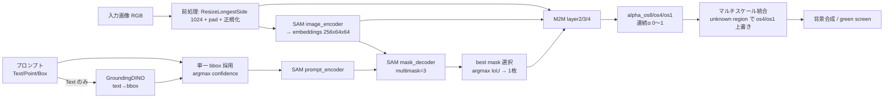

# Matting-Anything（MAM）BBOX・マスク・トラッキング・マスク統合 フロー調査報告

- **作成日時**: 2026-06-04 22:27:47
- **対象**: オリジナル Matting-Anything（MAM）の静止画推論フロー
- **調査ファイル**: `gradio_app.py` / `networks/generator_m2m.py` / `networks/m2ms/conv_sam.py` / `networks/m2ms/__init__.py` / `segment-anything/segment_anything/modeling/sam.py` / `SAM2_Haystack_SAM_USAGE_REPORT.md`
- **目的**: 「BBOX 生成 → SAM マスク → matting → マスク統合」の各段で、MAM が何をどう受け渡しているかを確定し、現行の動画パイプライン（別調査）と比較する土台を作る。

---

## 0. 結論サマリ（先に要点）

1. **MAM は SAM の二値マスクを「最終出力」として使わない。** SAM マスクは matting network（M2M）への **ガイダンス（条件入力）** に過ぎず、最終成果は M2M が出力する **連続値 α マット（0〜1）** である。
2. **MAM は単一インスタンス専用。** 複数オブジェクトを 1 回で囲む UI も、複数マスクを OR 統合（union）する処理も存在しない。GroundingDINO が複数 bbox を返しても **最高 confidence の 1 個だけ**を採用する。
3. **MAM にトラッキング（フレーム間伝搬）はない。** 静止画 1 枚ごとに独立して SAM → M2M を実行する。動画対応は別系統（SAM2 ベース）で実装されている。
4. したがって「BBOX をそのまま union マスク範囲に使う」という挙動は **オリジナル MAM には存在しない**。BBOX は SAM の prompt（領域ヒント）に渡るだけで、出力マスクの形は SAM/M2M が画素単位で決める。

---

## A. 入力プロンプト方式と UI 入力経路

MAM の `gradio_app.py` は 3 種類のプロンプトを受ける。

| 方式 | UI 要素 | 内部変換 | SAM へ渡す形 |
|---|---|---|---|
| テキスト | `gr.Textbox`（例: "the girl in the middle"） | GroundingDINO で text → bbox | bbox `(1, 4)` |
| スクリブル点 | `gr.ImageEditor` + `task_type="scribble_point"` | `ndimage.label()` で描画画素群の重心算出 | `point_coords (N,2)`, `point_labels (N,)=1` |
| スクリブル枠 | `gr.ImageEditor` + `task_type="scribble_box"` | 描画画素の min/max から外接矩形 | bbox `(1, 4)` |

- UI は `gr.ImageEditor(type="numpy")` で画像とスクリブルレイヤーを取得し、RGBA→RGB 変換後にプロンプトへ変換する。
- **重要**: どの方式でも最終的に SAM へ渡るのは **単一の bbox または単一の point set**。複数ターゲットの同時指定経路はない。

---

## B. SAM の呼ばれ方と出力・M2M への渡し方

- 初期化: `networks.get_generator_m2m(seg='sam_vit_b', m2m='sam_decoder_deep')`（`generator_m2m.py`）。SAM ViT-B を `segment-anything/checkpoints/sam_vit_b_01ec64.pth` から読み込む。
- 推論メソッド: `forward_m2m_inference(input_dict, multimask_output=True)`。
  - 入力 `input_dict`: `image (B,3,1024,1024)`, `bbox (N,4)` または `point/label`, `ori_shape`, `pad_shape`。
- SAM 内部（`segment-anything/.../modeling/sam.py` の `forward_m2m_inference`）:
  1. `image_encoder`: `(B,3,1024,1024)` → `image_embeddings (B,256,64,64)`。
  2. `prompt_encoder`: bbox/point → sparse/dense embeddings。
  3. `mask_decoder(multimask_output=True)`: 候補 3 マスク `low_res_masks (1,3,256,256)` と `iou_predictions (1,3)`。
  4. **best mask 選択**: `argmax(iou_predictions)` で 1 枚に絞り `(1,1,256,256)`。

**SAM が M2M へ渡すもの**（`generator_m2m.py`: `pred = self.m2m(feas, image, masks)`）:
- `feas` = `image_embeddings (B,256,64,64)`
- `image` = 正規化済み RGB `(B,3,1024,1024)`
- `masks` = SAM の二値マスク `(N,1,256,256)`

→ **SAM マスクは「ここが大体ターゲット」というガイダンス**であり、そのまま出力されるわけではない。

---

## C. M2M（matting network）が α マットを生成する仕組み

- ネットワーク: `SAM_Decoder_Deep(nc=256, layers=[2,3,3,2])`（`networks/m2ms/conv_sam.py`）。
- `forward(x_os16, img, mask)` の多段アップサンプリング:
  1. **layer2**: `cat(x_os16, img_os16, mask_os16)` → `(B,260,64,64)` → `(B,128,128,128)`、`refine_OS8` → `alpha_os8 (B,1,128,128)`。
  2. **layer3**: `(B,132,128,128)` → `(B,64,256,256)`、`refine_OS4` → `alpha_os4 (B,1,256,256)`。
  3. **layer4 + conv1(ConvTranspose2d)**: `(B,68,256,256)` → `(B,32,1024,1024)`、`refine_OS1` → `alpha_os1 (B,1,1024,1024)`。
- 出力は `tanh` 後に `(tanh(x)+1)/2` で `[0,1]` に正規化した **連続値 α**。
- 返り値 dict: `alpha_os1` / `alpha_os4` / `alpha_os8` /（解像度合わせした）`mask`。

→ **最終成果は二値マスクではなく連続 α マット**。髪・境界のソフトさはここで表現される。

---

## D. フロー全体（段階的）

1. 画像前処理（1024 へ resize+pad、ImageNet 正規化）。
2. プロンプト準備（Text は GroundingDINO で bbox 化、複数検出は最高 confidence 1 個）。
3. SAM image encoding → embeddings。
4. SAM prompt encoding & mask 生成（3 候補 → IoU 最大 1 枚）。
5. M2M で α 多段推定（os8→os4→os1）。
6. **マルチスケール統合**: os8 を元解像度へ補間して初期 α、エッジ周辺の unknown region を os4/os1 で上書き精緻化。
7. 背景合成: `composite = α·前景 + (1-α)·背景`。

> 補足: ここでの「統合」は **複数オブジェクトの統合（union）ではなく、同一対象の複数解像度 α の統合（精緻化）** を指す。語が紛らわしいので現行動画版の調査で明確に区別する。

---

## E. 複数オブジェクト処理・マスク統合（union）

- **GUI**: 単一 bbox / 単一 point set / 単一 text のみ。複数オブジェクト同時選択 UI なし。
- **GroundingDINO 複数検出時**: NMS 後 `bbox = detections.xyxy[argmax(confidence)]` で **1 個だけ採用**。
- **`guidance_mode`**: "mask"（複雑シーン用）/ "alpha"（単一インスタンス用）の言及はあるが、**実装上はどちらも単一 bbox 処理**。
- **union 処理（複数マスクの OR/AND 統合）は存在しない**。「人＋ドラム」を 1 回で取る経路はオリジナル MAM にない。

→ 本プロジェクトの目的（「ドラムを叩く人＝ドラム＋人」）は **オリジナル MAM 単体では達成できない**。複合対象は別途 union 機構が必要。

---

## F. トラッキング（動画・フレーム間伝搬）

- **MAM 本体にトラッキングなし。静止画 1 枚単位**。
- `forward_m2m_inference` に `frame_idx` / temporal state の引数はなく、SAM mask・M2M α はフレーム独立計算。
- 動画対応は SAM2 ベースの別ファイル（`gradio_app_sam2_transparent_BG_haystack_for_Movie.py` 等）で実装。MAM は静止画 matting のみが責務。

---

## G. 現行動画パイプラインへの示唆（次調査への橋渡し）

1. オリジナル MAM の強み（**連続 α マット**）は、現行動画版が採用する **SAM2 二値マスク → transparent-background** とは別物。動画版は MAM の matting を使っていない。
2. 「複合対象（ドラム＋人）」「トラッキング」は、いずれも **MAM の守備範囲外**で、動画版が独自に SAM2 multi-box union + 伝搬で実現すべき要件。
3. 「BBOX をそのまま union マスク範囲に使っている疑い」は、MAM 由来の挙動ではない。原因は動画版側の **BBOX→SAM2→union の配線**にあると考えられる（→ 次調査で検証）。

---

*本報告はコードリードのみ（変更なし）。根拠は各節記載のファイル・関数名による。*
