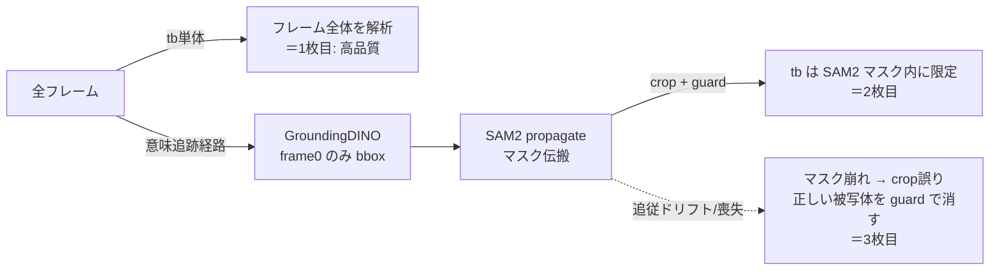

調査完了しました。コードを追った結果を報告します。

## 結論：GroundingDINO は「第1フレームだけ」で意味追跡している

ご推測のとおりです。GroundingDINO がテキストで意味解釈するのは**最初の1フレームのみ**で、以降のフレームは一切見ていません。

### 処理の流れ（動画版）

1. **意味解釈（GroundingDINO）= 1回だけ**
   - gradio_app_sam2_transparent_BG_haystack_for_Movie.py の `detect_text_boxes_for_video()` が `get_text_detector().run(image=first_frame, ...)` を呼ぶ
   - `first_frame` は gradio_app_sam2_transparent_BG_haystack_for_Movie.py が `max_frames=1` で取った第1フレーム
   - → GroundingDINO は frame 0 で bbox を出すだけ。**フレームごとの再検出はしない**

2. **追跡（SAM2）= bbox を種にして伝搬**
   - video_model_components.py で `add_new_points_or_box(frame_idx=prompt_frame_idx, ...)` を**1回**呼び、`propagate_in_video()` で全フレームへマスクを伝搬
   - 以降の追従は SAM2 の memory-attention だけが担う。**GroundingDINO による意味的な再アンカーは一切ない**

3. **背景透過（transparent-background）= SAM2 マスクで強くゲートされる**
   - model_components.py の `TransparentBGExtractor.run()` は SAM2 マスクで
     - マスクの外接 bbox に**クロップ**してから tb を実行（`mask_to_bbox` + `crop_padding`）
     - `mask_guard` で**SAM2 マスク形状の外の alpha を 0 に潰す**

### なぜ tb 単体は良いのに、追跡を挟むと劣化するか

- **1枚目（tb 単体）が良い理由**：SAM2 のクロップもガードも通らず、フレーム全体をそのまま tb が処理するため。
- **2〜3枚目が劣化する理由**：tb の品質が SAM2 マスクの正確さに**完全従属**している。SAM2 の追跡がドリフト・喪失すると、
  - クロップ bbox がずれて被写体が枠外に出る
  - `mask_guard` が「正しい被写体領域」を 0 に潰す（3枚目の追跡剥がれはこれ）
  
  → tb 自体は優秀でも、上流の SAM2 マスクが間違えた時点で出力が崩れる構造です。

### 改善の方向性（参考）

トラッキング能力が低く感じる根本は「意味アンカーが frame0 限定」+「tb が SAM2 マスクに従属」の2点です。検討候補：

1. **GroundingDINO を定期的に再実行**（N フレームごとに再検出して SAM2 を re-prompt し、ドリフトを補正）
2. **SAMURAI バリアントへ切替**（`INFERENCE_TRACKER_VARIANT` / config 切替。motion-aware で素の SAM2 より追従が安定）
3. **`mask_guard` の緩和**（`mask_guard_feather` や dilate を増やし、マスク誤差での被写体消失を抑える）
4. **per_object モードの活用**（複数 bbox を別 obj として追跡し union）

---

## 追加調査（2026-06-19 第2回）: SAMURAI 利用状況とポイントプロンプトの検証

### ① 既に SAMURAI になっているか → いいえ、デフォルトは標準 SAM2

- UI の tracker ドロップダウン初期値は `gradio_app_sam2_transparent_BG_haystack_for_Movie.py` で `value="sam2_hiera_l"` = **「SAM2.1 Hiera-Large (standard)」**。
- SAMURAI を実際に使うには **両方**が必要：
  1. ドロップダウンで `samurai_hiera_l`（SAMURAI Hiera-Large）を**手動選択**。
  2. 環境変数 `INFERENCE_TRACKER_VARIANT=sam2_samurai` を設定（`config/inference_models.toml` の `requires = "sam2_samurai"`）。
- `INFERENCE_TRACKER_VARIANT` はリポジトリ内で**どこにも設定されていない**（テストでのみ monkeypatch）。env 未設定だと「全 tracker が選択肢に出る」だけで、**実行されるのは初期値の標準 SAM2**。
- `samurai_mode` フラグも config 名に "samurai" を含む時だけ True（`video_model_components.py`）。標準 SAM2 では motion-aware 補正は効いていない。

→ **追跡が弱い主因の一つは「素の SAM2 で動かしているから」。** SAMURAI へ切り替えれば改善余地がある。

### ② ポイントプロンプトの box+point 結合 → コードは正しい。貼られた症状には該当しない

「box と点を別 obj_id にすると点が落ちる」症状は**このコードでは起きていない**。実装は推奨形そのもの：

- 手動 box+point（単一対象）は `video_model_components.py` で **同じ `obj_id` に box と points を1コール同梱**。
- SAM2 本体 `samurai/sam2/sam2/sam2_video_predictor.py` が box を**コーナー点（label 2,3）に変換しユーザー点の前に連結**（コメント "consistent with how SAM 2 is trained"）。1コール同梱が正しい結合形。
- 複数 box（GroundingDINO union）も `assign_points_to_boxes`（`common.py`）で**各点を最近傍 box の同じ obj_id に同梱**。点が別 obj に落ちる実装ではない。

### ③ では、なぜ点が「効いてない」ように見えるか → 点は frame0 しか条件付けしないから

- box も points も**プロンプト起点フレーム（既定 frame0）にしか適用されない**。以降は SAM2 memory 伝搬のみ。
- 点は frame0 では効くが、**追跡がドリフトした後のフレームには frame0 の点は届かない**。
- → 「追跡失敗のせいで点が無意味に見える」という感覚は正確。点が壊れているのではなく、**点の効力が下流フレームへ伝わらない構造**。

### ④ 改善案4（per_object）の訂正 → 追跡が剥がれたら無意味なので撤回

- per_object は「複数対象を別々に追跡して union」するだけで、**各対象の追跡そのものが剥がれたら全部剥がれる**。追跡の堅牢性向上策ではないため撤回。

### 有効打（優先順・確定版）

1. **GroundingDINO を N フレームごとに再実行 → re-prompt**（frame0 限定の意味アンカーを定期更新し、点も再投入できる）。
2. **SAMURAI へ切替**（①の前提を満たす。motion-aware で素 SAM2 のドリフトを抑制）。
3. **mask_guard の手動調整 UI**（feather/dilate のチェックボックス + 範囲設定、既定オフ。追跡が少しズレた時に正しい被写体を消さない）。

→ 上記 1 / 2 / 3 の実装計画は `計画書/2026-06-19_意味追跡ドリフト改善_DINO再検出_SAMURAI_maskguard計画.md` を参照。